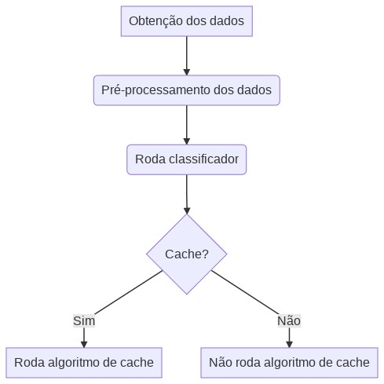

# Web Proxy Cache Inteligente

This repository contains my final work for the Computer Engineering graduation at the [Unipinhal](https://www.unipinhal.edu.br/), titled "Web Proxy Cache Inteligente".



## Resumo

Com aplicações em rede recebendo cada vez mais usuários e a
quantidade de conteúdo que é gerada e consumida, técnicas de cache
acabam se tornando uma ferramenta poderosa, para ajudar a reduzir o
tempo de resposta de requisições, do lado do servidor, para vários clientes
e entregar conteúdos computacionalmente caros de serem processados
de forma rápida e eficiente. O objetivo deste trabalho é comparar
algoritmos tradicionais de cache, como o LRU (Least recently used) e LFU
(Least-frequently used), com um sistema proposto que utiliza algoritmos
de aprendizagem de máquina um estágio anterior ao algoritmo de cache.
Neste artigo utilizou-se os algoritmos de árvore de decisão, random forest
e gradient boosting para a tarefa de classificação. Os resultados
demonstraram que a utilização de um algoritmo de classificação pode
ajudar na seleção de quais objetos precisam estar em cache. Também foi
demonstrado que é possível a implementação do sistema proposto em um
ambiente real devido ao baixo tempo de execução do algoritmo proposto.

## Executando

### Configurações inicias
Os testes foram executados utilizando o Python 3.8.5.

Antes de executar os notebooks é necessário rodar o comando:
```shell
$ pip3 install -r requirements.txt
```


### Obtenção dos dados
O repositório contém o dataset utilizado nos testes `final_datasets/df_ml.csv`.

Caso seja do interesse criar um novo dataset é necessário, atualmente é necessário utilizar a ferramenta [deepcache_netai2018](https://github.com/eman-ramadan/deepcache_netai2018). Ela permite a criação de um dataset onde os elementos gerados possuem uma distribuição de popularidade ao longo do tempo. Para ser executado de maneira direta o arquivo gerado precisa ser salvo com o nome `syntheticDataset_O50.csv` em um pasta chamada `datasets`.<br>
Em seguida basta executar o arquivo `1 - Padroniza Datasets.ipynb`

### Executando os experimentos
Para rodar os experimentos basta rodar o arquivo `2 - Executa experimentos.ipynb`

## Autores

### Orientador
 - Prof. Dr. José Tarcísio Franco de Camargo

### Orientado

 - Alexandre Ferreira